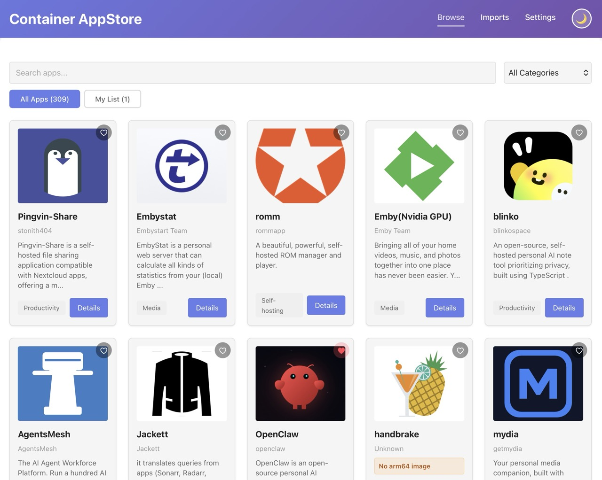
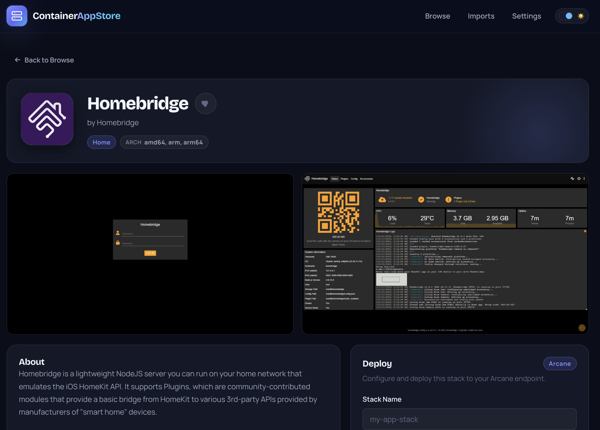
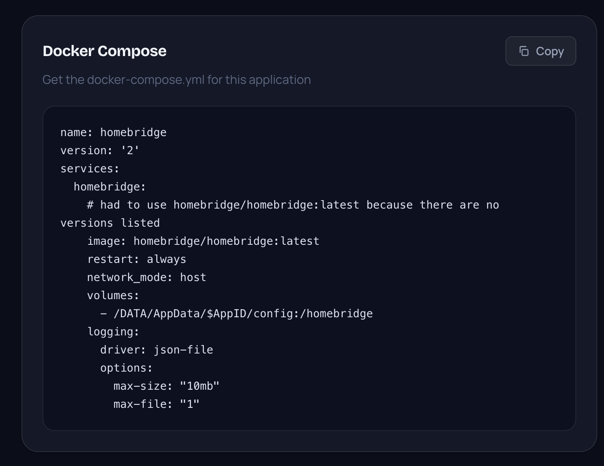
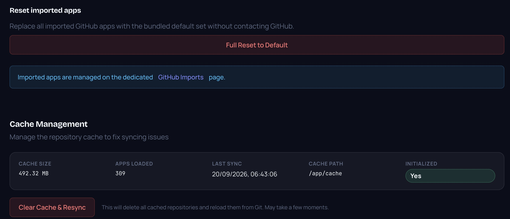
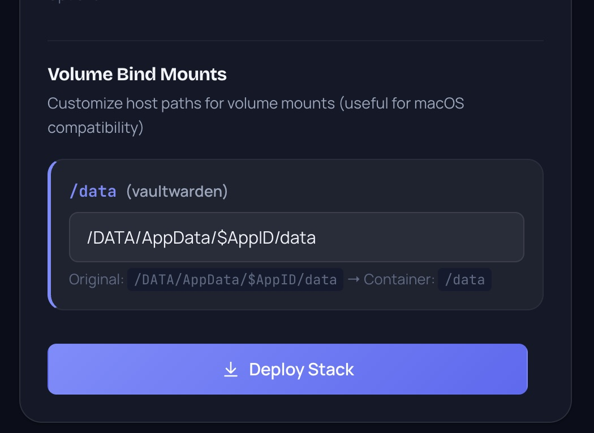
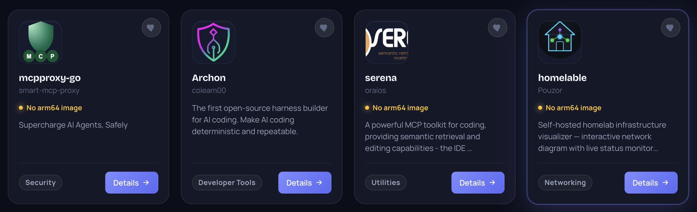
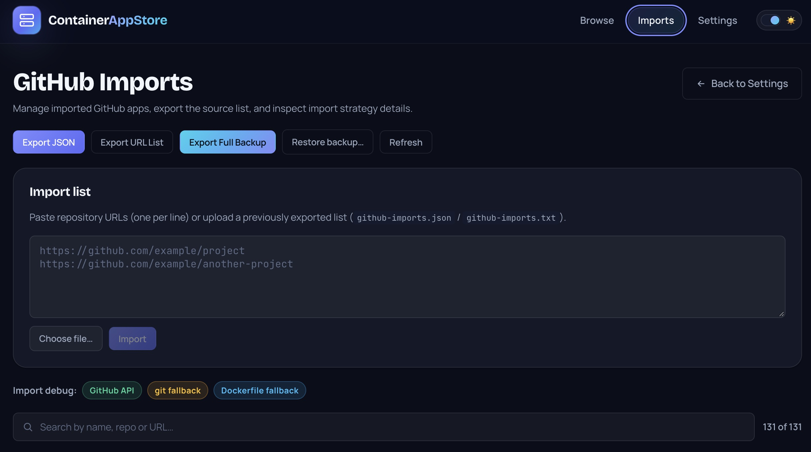
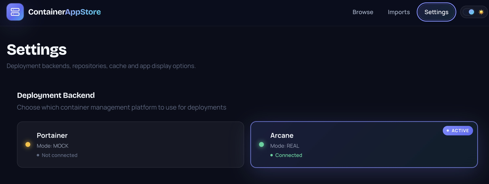
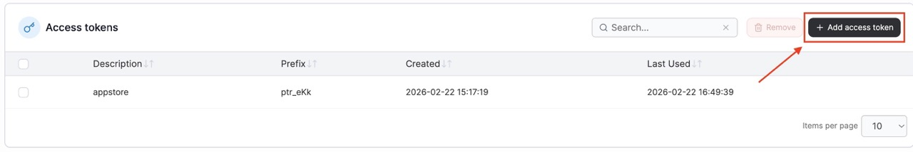

# Container AppStore Bridge

**v1.1.2** — A Docker app store with dual-backend support, resilient GitHub app importing, full backup/restore, a dedicated imports management page, a "New apps" page with version snapshots, and a premium dark-first UI.

Browse and deploy containerized applications from CasaOS-compatible app stores (or any custom Git repository) to your chosen container management platform.



## Features

- Browse apps from multiple Git repositories (CasaOS AppStore, LinuxServer, BigBear, custom)
- Import standalone GitHub repositories and auto-generate app pages from `docker-compose.yml` or `Dockerfile`
- Smart duplicate detection: URLs are canonicalized so `owner/repo`, `owner/repo.git/`, trailing slashes and case variants all resolve to the same import
- Dedicated GitHub Imports page with **search and pagination** for long catalogs, plus resync/delete/export workflows
- **New apps page** (`/new`) — shows apps added since the previous version, with a **NEW** badge on browse cards and a nav counter
- **Full backup export** — complete app snapshot (compose content, images, metadata) as a single JSON file
- **One-click restore** from a backup without contacting GitHub (no rate-limit issues)
- **Full Reset to Default** button in Settings — restores the bundled default catalog
- Fresh installs are **auto-populated from the bundled backup** (no GitHub calls on first boot)
- **Redeploys auto-merge newer bundled backups** — when a new image ships a new `github-imports-backup.json`, the catalog updates on boot (new apps added, existing updated, manual imports never deleted)
- Per-app **Resync button** on GitHub-imported app detail pages (re-imports the repository from GitHub)
- Import error details modal showing exactly why a repository was skipped
- Import debug badges showing GitHub API, git fallback, or Dockerfile fallback strategy
- Architecture compatibility detection and warnings for container images that do not support the current host
- App favicon bundle (`favicon.ico`, SVG/PNG variants, apple-touch-icon, webmanifest) with a consistent branded mark
- Search, filter by category, paginated browsing
- Deploy to **Portainer** or **Arcane** with a single click
- Favorite apps for quick access
- Dynamic deploy form (env vars, volume bind mounts)
- **Premium dark-first UI** — glassmorphism design system with ambient glows, custom typography (Bricolage Grotesque + Manrope), glowing cards and micro-interactions
- Backend configuration (Portainer/Arcane) grouped into clean **tabs** in Settings
- **Broken-image fallback** — app icons/screenshots that 404 on the remote host automatically show a placeholder
- **SPA refresh support** — refreshing any route (`/settings`, `/app/...`, `/imports/github`) no longer returns a 404; deep links work directly
- Light/dark theme with improved screenshot lightbox controls
- Mock mode for development without real infrastructure
- Runs entirely in Docker

## Screenshots

| Dashboard | App Detail |
|-----------|------------|
|  |  |

| Docker Compose | Cache Management |
|----------------|------------------|
|  |  |
| Deploy container | Check arch |
|----------------|------------------|
|  |  |
| GitHub Import |  Settings |
|---------------|----------|
|  |  |


Portainer API token setup: 

## Quick Start

```bash
# Clone and start
git clone https://github.com/tosolini/appstore.git
cd appstore
cp .env.example .env

# Edit .env with your Arcane or Portainer details
# Then start:
docker compose up -d --build

# Open http://localhost:8888
```

On first boot the app auto-populates the catalog from the bundled default imports backup — no manual GitHub import needed.

## Common Commands (Makefile)

A `Makefile` wraps the most common Docker Compose tasks:

```bash
make up        # Start containers in background
make down      # Stop and remove containers
make build     # Build the image
make rebuild   # Build → down → up (full restart with fresh image)
make restart   # Restart containers
make logs      # Follow API logs
make shell     # Interactive shell in the API container
make ps        # Container status
make help      # List all commands
```

## Backend Selection

The app supports two deployment backends. Configure via env vars:

| Backend | Env Vars |
|---------|----------|
| **Arcane** | `ARCANE_BASE_URL`, `ARCANE_API_KEY`, `ARCANE_ENVIRONMENT_ID` |
| **Portainer** | `PORTAINER_BASE_URL`, `PORTAINER_API_KEY`, `PORTAINER_ENDPOINT_ID` |

Set `ACTIVE_BACKEND=auto` to auto-detect, or `arcane`/`portainer` to force.

### Arcane Setup

See [docs/Arcane-Setup.md](docs/Arcane-Setup.md).

### Portainer Setup

See [docs/wiki/Portainer-Setup.md](docs/wiki/Portainer-Setup.md).

## Persistent Data

Data persists across restarts and image updates via bind mounts and volumes:

| Mount | Path in container | Stores |
|-------|-------------------|--------|
| `./data/` | `/app/data` | SQLite database (settings, repos, deploy logs, encryption key, favorites) |
| `appstore_cache` | `/app/cache` | Cloned Git repositories (app metadata) |

The database file lives at `./data/appstore.db` on your host — you can inspect or back it up directly.

To reset everything:
```bash
docker compose down -v
rm -rf data/
```

## Deployment

```bash
# Development (build from source)
docker compose up -d --build

# Production (prebuilt image from GitHub Container Registry)
docker compose -f docker-compose.prod.yml --env-file .env.production up -d
```

The production compose pulls `ghcr.io/tosolini/appstore:latest` (built automatically by CI on push to `main`/`master`) instead of building locally. Override the image via `APPSTORE_IMAGE` (e.g. `APPSTORE_IMAGE=ghcr.io/tosolini/appstore:v1.1.0`).

## GitHub Imports & Backup

The app can import any public GitHub repository that ships a `docker-compose.yml` or a `Dockerfile`, persisting the generated app directly into the catalog.

> **Tip:** set `GITHUB_TOKEN` in `.env` to avoid GitHub API rate-limit `403`s during imports. Without a token the importer falls back to shallow `git clone` / HTML metadata, which still works but is slower and less reliable for large catalogs.

- **Import** — paste one URL per line (Settings or the GitHub Imports page), or upload an exported list. URLs are canonicalized, so importing the same repo twice — even with a `.git` suffix or different case — updates the existing entry instead of duplicating it.
- **Resync** — every GitHub-imported app has a Resync button on its detail page (after the Import row) to re-import the repository on demand.
- **Search & paginate** — the GitHub Imports page filters live by name/repo/URL and paginates long catalogs (20 per page).
- **Backup** — *Export Full Backup* downloads `github-imports-backup.json`, a complete snapshot with compose content, images and metadata. Restoring it requires **no GitHub access**, so catalogs with 100+ apps restore instantly without hitting API rate limits.
- **Reset** — *Full Reset to Default* in Settings wipes current imports and restores the bundled default set.
- **Auto-update on redeploy** — when a new image ships a newer bundled backup, startup merges it automatically (adds new apps, updates existing ones, never deletes manual imports or flags everything as NEW).

The importer:

- falls back to a shallow `git clone` when GitHub API metadata or tree listing is rate-limited
- accepts non-standard compose filenames such as `docker-compose.dev.yaml` and similar Docker YAML variants, plus any `*.yml`/`*.yaml` inside a `docker/` directory
- accepts `Dockerfile` variants (`Dockerfile.alpine`, `Dockerfile.custom`, `*.dockerfile`, …) anywhere in the repo, with an explicit fallback search inside the repo's `docker/` folder
- inspects container image manifests when possible so imported apps can warn when the current host architecture is not published by one or more referenced images
- records import debug metadata so you can tell whether an app came from the GitHub API, git fallback, docker-dir fallback, or Dockerfile fallback path

## Architecture

```
frontend/          ← Vue 3 SPA (Vite)
  ├── src/views/   ← Pages (Home, NewApps, AppDetail, Settings, GitHubImports)
  ├── src/components/ ← Reusable components (DeployForm, AppCard)
  ├── src/directives/ ← Global directives (e.g. broken-image fallback)
  ├── src/styles/   ← Design system (theme.css, CSS variables, light/dark)
  └── public/       ← PWA icons (favicon, apple-touch-icon, webmanifest)
src/               ← Python FastAPI backend
  ├── main.py      ← API routes, backend dispatch, imports/backup/reset, SPA fallback
  ├── portainer/   ← Portainer client (kept for compat)
  ├── arcane/      ← Arcane client
  ├── github_import/ ← GitHub importer + metadata enrichment + URL canonicalization
  ├── parsers/     ← Docker Compose parser
  ├── git_sync/    ← Repository sync
  ├── db/          ← SQLite + SQLAlchemy
  ├── models/      ← Pydantic models
  └── security/    ← Encryption (Fernet)
docs/              ← User documentation + screenshots
```

## API

- `GET /health` — Health check
- `GET /apps` — List apps
- `GET /apps/{id}` — App detail
- `POST /apps/{id}/deploy` — Deploy to active backend
- `GET /api/imports/github` — List imported GitHub apps
- `POST /api/imports/github` — Import GitHub repositories into the app catalog
- `GET /api/imports/github/export?format=json|urls|full` — Export imported apps (JSON list, URL list, or full backup)
- `POST /api/imports/github/restore` — Restore a full backup (multipart file upload, no GitHub calls)
- `POST /api/imports/github/reset` — Reset imports to the bundled default set
- `POST /api/imports/github/{id}/resync` — Refresh one imported GitHub app
- `POST /api/imports/github/by-app/{app_id}/resync` — Refresh one imported GitHub app by app_id (used by the detail page)
- `POST /api/imports/github/snapshot` — Record the catalog baseline for a frontend version
- `GET /api/imports/github/new` — Apps added since the previous version
- `GET /api/imports/github/new-ids` — IDs of new apps (for NEW badges)
- `DELETE /api/imports/github/{id}` — Delete one imported GitHub app
- `GET /api/settings/backend` — Backend status
- `POST /api/settings/backend/select` — Switch backend

Full API docs available at `/docs` (Swagger) when the server is running.

### GitHub repo import

You can paste GitHub repository URLs in the Settings page, then manage large import lists from the dedicated Imports page, or call the API directly:

```bash
curl -X POST http://localhost:8888/api/imports/github \
  -H 'Content-Type: application/json' \
  -d '{
    "repositories": [
      "https://github.com/mostafa-wahied/portracker",
      "https://github.com/gamosoft/NoteDiscovery"
    ]
  }'
```

Imported repositories are persisted and merged into the normal app list, so they appear in browse/search/detail pages like any other app.

## Author
Walter Tosolini https://www.tosolini.info


## License

MIT — see [LICENSE](LICENSE).